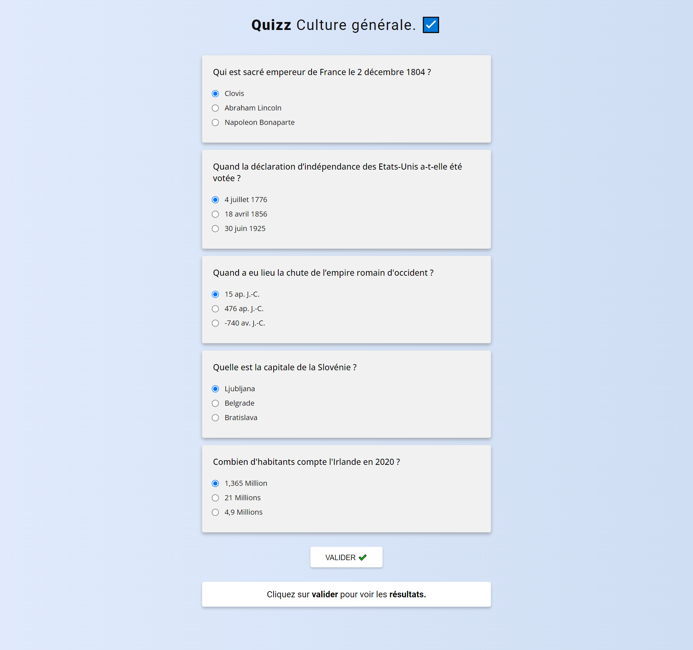

# Udemy - 20 javascript projects - Quizz app

This is a solution to the [Quizz app from Udemy](https://www.udemy.com/course/20-projets-en-javascript/).

## Table of contents

- [Overview](#overview)
  - [The challenge](#the-challenge)
  - [Screenshot](#screenshot)
  - [Links](#links)
- [My process](#my-process)

  - [Built with](#built-with)
  - [What I learned](#what-i-learned)
  - [Continued development](#continued-development)

- [Author](#author)

## Overview

### The challenge

Users should be able to:

- View the optimal layout for the app depending on their device's screen size
- See hover states for all interactive elements on the page
- Manage the form.
- Test the results.
- Add a message in the end block based on the results.
- Add colors according to the results.
- Manage the possibility of a correction attempt by the user (change a value and re-validate).

### Screenshot

### Links

- Solution URL: [Github link](https://github.com/Stv-devl/Quizz-fr-)
- Live Site URL: [Live link]()

## My process

### Built with

- Semantic HTML5 markup
- CSS custom properties
- Flexbox
- CSS Grid
- Mobile-first workflow
- SASS / SCSS
- Vanilla JS

### What I learned

I learned to practice javascript.

### Continued development

## Author

- Website - [Github](https://github.com/Stv-devl)
